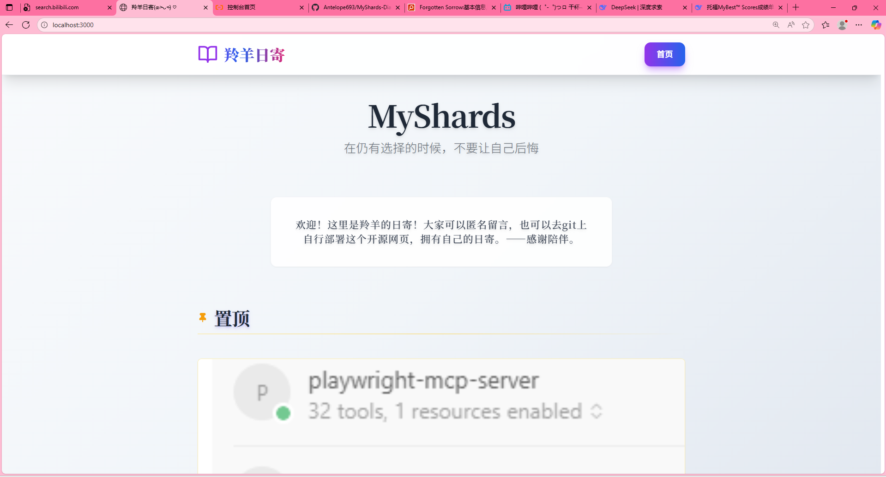

# 📔 MyShards - 个人时空碎片记录站 (V1.0.1)

> 记录当下的碎片，构建未来的回忆。

MyShards 是一个优雅、现代化的个人日记与创作空间系统。它不仅仅是一个日记本，更是一个连接自我与外界的时空枢纽。

## ✨ 最新特性 (V1.0.1)

### 1. 沉浸式阅读与书写
- **优雅的时间轴**：按年月自动归档，支持 Markdown 渲染，像画卷一样展开你的记忆。
- **丰富的媒体支持**：支持嵌入图片、视频（链接）、代码块，并通过调整图片宽度实现图文混排。
- **置顶与分类**：通过"置顶回忆"和"日记合集"整理重要内容或连载故事。

### 2. 社交与发现 ("We" & "They")
- **我们 (We)**：发现其他部署了 MyShards 的同行者，建立你的星际邻居网络。
- **他们 (They)**：随机漫游全网公开的日记碎片，支持"最新发布"、"热门收藏"和"随机漫游"模式。

### 3. 深度的创作者体验
- **新手教程 (Tutorial)**：全新引入的引导式的操作指引，帮助你快速熟悉界面功能（可在"更多功能"中随时回顾）。
- **问题反馈 (Q&A)**：内置 Issue 系统，直接向站点维护者发送建议或反馈，支持公开讨论与回复。
- **协作生涯**：未来的多人协作功能（生涯模式）即将上线。

### 4. 强大的后台管理
- **可视化编辑**：所见即所得的 Markdown 编辑器。
- **用户管理**：支持多用户注册（需邀请或开放），管理员拥有完整权限。
- **安全性**：JWT 鉴权、密码加密、SQL 注入防御、XSS 过滤。

---

##   快速上手 

1. **访问站点**：打开部署好的网站首页。
2. **新手引导**：跟随屏幕上的高亮指引，了解各个功能区。
3. **注册/登录**：
   - 点击右上角进入"管理后台"或"游客模式"进行登录。
   - 首次登录后，可以在个人中心查看"我的收藏"、"我的关注"。
4. **开始创作**：
   - 进入后台 -> 新建日记。
   - 填写标题，启用"置顶"或加入"合集"。
   - 发布后，你的日记将即时出现在时间轴上。

## 📚 维护与更新

- **运维手册**：查看 **[MAINTENANCE_GUIDE.md](./MAINTENANCE_GUIDE.md)** 了解如何备份数据库、更新代码和排查故障。
- **配置文件**：所有敏感配置（数据库密码、端口等）均在 `.env` 文件中管理。

## 🔒 版权与许可

本项目采用 MIT 许可证开源。你可以自由使用、修改和分发，但请保留原作者 (Antelope693) 的版权声明。

---
*Created with  by 羚羊
