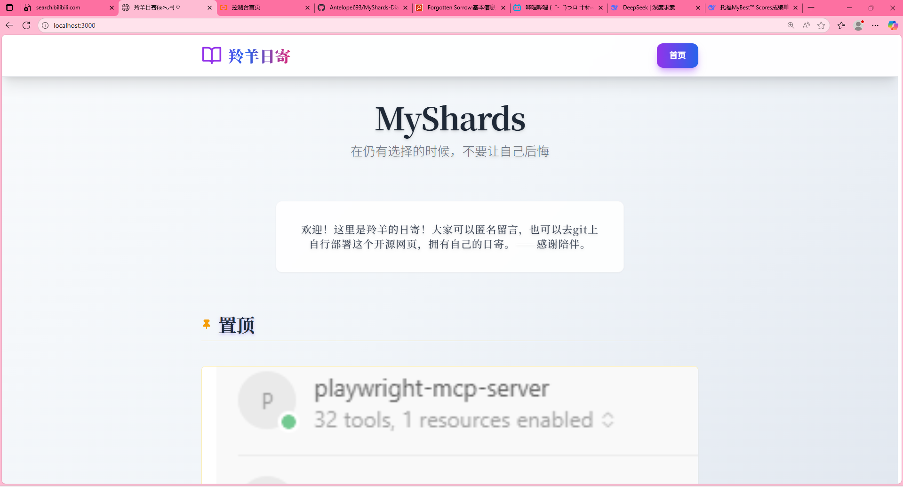
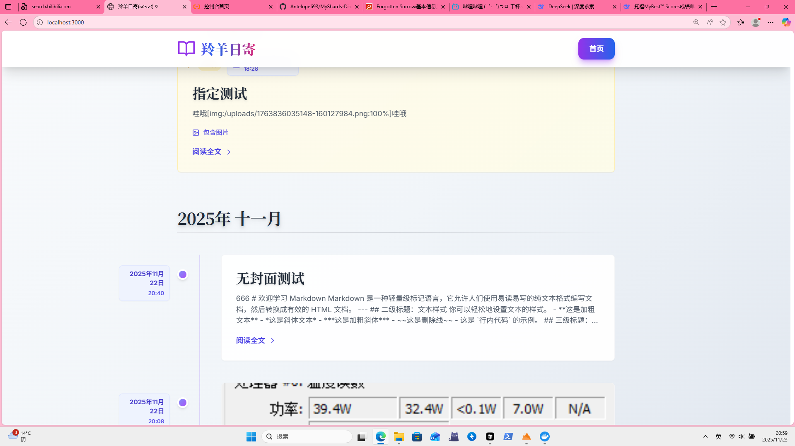
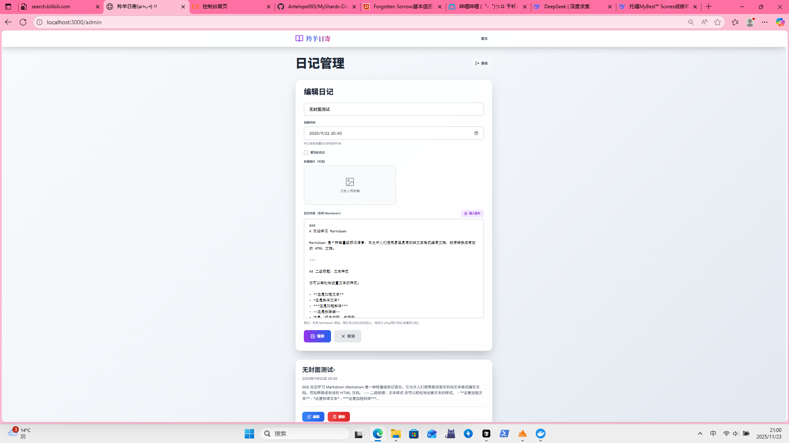

# 📔 MyShards - 个人日记系统 by 羚羊

一个优雅、现代的日记系统，支持 Markdown、图片上传、评论等功能。

## 📸 界面展示

### 首页展示


### 时间轴展示


### 后台管理


## ✨ 特性

- 📝 **Markdown 支持**：自动识别并渲染 Markdown 格式
- 🖼️ **图片管理**：支持封面图片和正文内嵌图片，可调整大小
- 📌 **置顶功能**：重要日记可以置顶显示
- 💬 **评论系统**：为每篇日记添加评论
- 🎨 **优雅界面**：响应式设计，支持移动端
- 🔒 **安全认证**：管理员页面需要密码保护
- 🐳 **Docker 部署**：一键部署，简单方便

## 🚀 快速开始

### 本地开发

1. **克隆项目**
   ```bash
   git clone <your-repo-url>
   cd Diary
   ```

2. **启动服务**
   ```bash
   # Windows
   start.bat
   
   # Linux/Mac
   chmod +x start.sh
   ./start.sh
   ```

3. **访问应用**
   - 前端：http://localhost:3000
   - 管理页面：http://localhost:3000/admin
   - 默认密码：`admin123`（请在生产环境中修改）

### 服务器部署

详细的部署指南请查看：

- **[完整部署指南.md](./完整部署指南.md)** - 从零开始的完整部署教程
- **[README-部署.md](./README-部署.md)** - 快速部署参考

**快速部署步骤：**

1. **准备配置文件**
   ```bash
   cp env.example .env
   nano .env  # 编辑配置文件
   ```

2. **填写必要配置**
   - `ADMIN_PASSWORD`: 管理员密码
   - `SERVER_DOMAIN`: 服务器域名或IP

3. **运行部署脚本**
   ```bash
   chmod +x deploy.sh
   ./deploy.sh
   ```

## 📚 文档

- **[完整部署指南.md](./完整部署指南.md)** - 详细的服务器部署教程（适合新手）
- **[前端修改指南.md](./前端修改指南.md)** - 前端界面自定义指南（无需编程基础）
- **[部署说明.md](./部署说明.md)** - 部署相关的高级配置和故障排除

## 🛠️ 技术栈

- **前端**：React + TypeScript + Tailwind CSS
- **后端**：Node.js + Express + TypeScript
- **数据库**：SQLite
- **部署**：Docker + Docker Compose

## 📖 使用说明

### 创建日记

1. 访问管理页面：`/admin`
2. 点击"新建日记"
3. 填写标题和内容
4. 可以上传封面图片
5. 可以在正文中插入图片（支持调整大小）
6. 可以设置创建时间和置顶状态
7. 保存日记

### 编辑日记

1. 在管理页面找到要编辑的日记
2. 点击"编辑"
3. 修改内容后保存

### 设置问候语

1. 在管理页面点击"设置问候语"
2. 输入每日问候语
3. 保存后会在首页显示

### Markdown 语法

支持标准 Markdown 语法：

```markdown
# 标题
**粗体**
*斜体*
- 列表项
[链接](url)
```

### 插入图片

在管理页面编辑日记时：
1. 点击"插入图片"按钮
2. 选择图片文件
3. 设置图片宽度（相对于日记宽度的百分比）
4. 图片会自动插入到当前光标位置

## 🔧 配置说明

### 环境变量

所有配置通过 `.env` 文件管理，主要配置项：

- `ADMIN_PASSWORD`: 管理员密码（必须修改）
- `SERVER_DOMAIN`: 服务器域名或IP
- `FRONTEND_PORT`: 前端端口（默认80）
- `BACKEND_PORT`: 后端端口（默认3001）

详细说明请查看 `env.example` 文件。

## 📝 项目结构

```
Diary/
├── frontend/          # 前端代码
│   ├── src/
│   │   ├── pages/     # 页面组件
│   │   ├── components/ # 通用组件
│   │   └── api/       # API 客户端
│   └── Dockerfile     # 前端 Docker 配置
├── backend/           # 后端代码
│   ├── src/
│   │   ├── routes/    # API 路由
│   │   ├── database.ts # 数据库操作
│   │   └── index.ts   # 服务器入口
│   └── Dockerfile     # 后端 Docker 配置
├── docker-compose.yml # 开发环境配置
├── docker-compose.prod.yml # 生产环境配置
└── .env              # 环境变量（需要创建）
```

## 🎨 自定义界面

想要修改前端界面？查看 [前端修改指南.md](./前端修改指南.md)，无需编程基础也能轻松自定义！

可以修改的内容包括：
- 网站标题和页面标题
- 颜色主题
- 字体样式
- 布局间距
- 时间显示格式

## 🔒 安全建议

1. **修改默认密码**：部署后立即修改 `ADMIN_PASSWORD`
2. **使用 HTTPS**：生产环境建议配置 SSL 证书
3. **定期备份**：备份 `backend/data` 和 `backend/uploads` 目录
4. **防火墙配置**：只开放必要的端口

## 🐛 故障排除

遇到问题？查看 [部署说明.md](./部署说明.md) 中的"故障排除"部分。

常见问题：
- 服务无法启动：检查 Docker 是否运行，端口是否被占用
- 无法访问：检查防火墙设置
- 登录失败：检查 `.env` 文件中的密码配置

## 📄 许可证

本项目采用 MIT 许可证。

## 📞 支持

如有问题，请：
1. 查看文档
2. 检查日志：`docker-compose logs`，提供给3112989263@qq.com
3. 提交 Issue

---

**享受记录生活的每一天！** ✨
